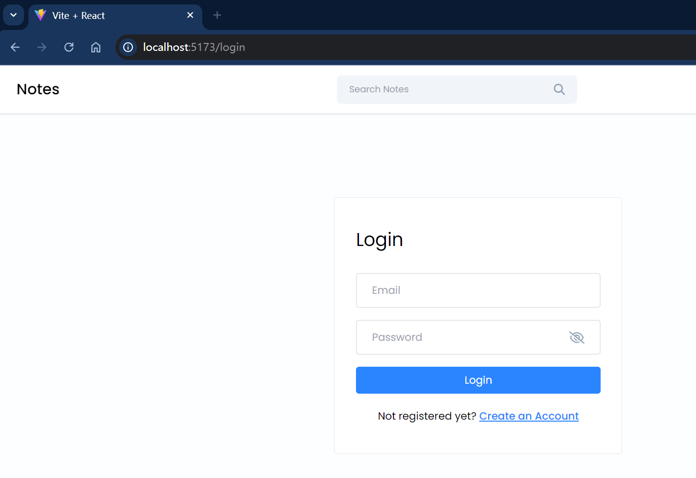
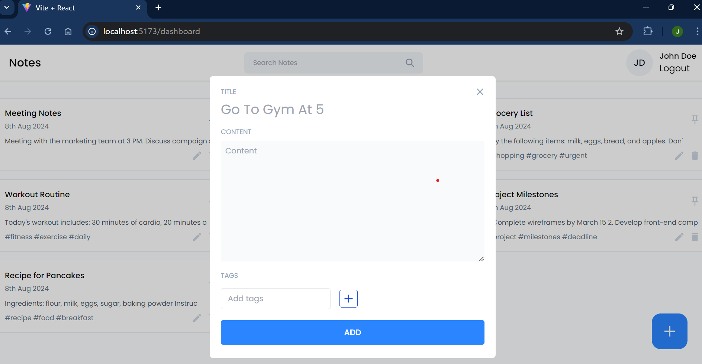
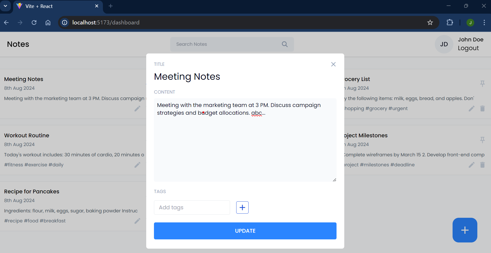
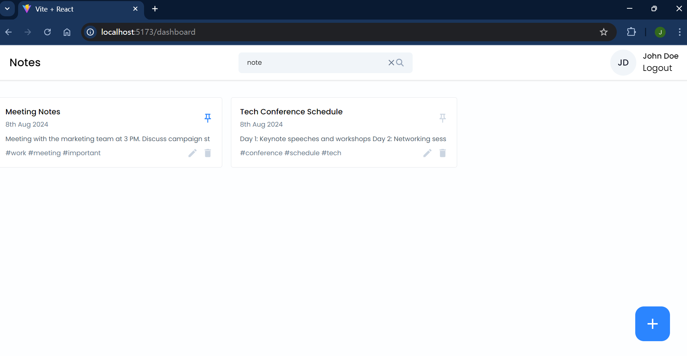
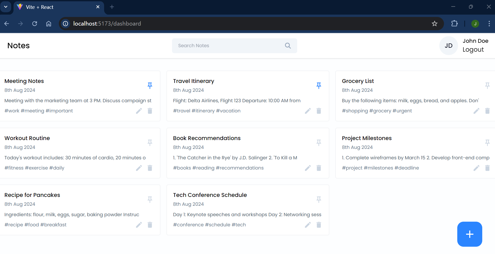

# NoteApp

This is a full-stack note-taking application built with the MERN stack. It allows users to create, manage, and organize their notes with features like tagging, searching, and pinning.

## Features

- **User Authentication**: Sign up, log in, and manage user accounts.
- **Create Note**: Add new notes with titles, content, and optional tags.
- **Edit Note**: Update note content, titles, tags, or pinned status.
- **Delete Note**: Remove notes by their ID.
- **Pin/Unpin Note**: Pin important notes to the top of the list.
- **Search Notes**: Find notes by searching for keywords in titles or content.
- **View All Notes**: Retrieve and display all notes, sorted with pinned notes first.

## Technologies

- **Frontend**: React.js
- **Backend**: Node.js with Express.js
- **Database**: MongoDB
- **Containerization**: Docker

## Prerequisites

Before you begin, ensure you have met the following requirements:

- **Docker**: You need Docker installed to build and run the application containers. You can download Docker from [docker.com](https://www.docker.com/get-started).

- **Docker Compose**: This tool is used to define and run multi-container Docker applications. Docker Compose is included with Docker Desktop, but you can also install it separately if needed. Visit [docs.docker.com/compose/install](https://docs.docker.com/compose/install/) for installation instructions.

- **Git**: Ensure you have Git installed to clone the repository. Download Git from [git-scm.com](https://git-scm.com/).

Once you have these prerequisites installed, you can follow the steps below to get started with the project.


## API Endpoints

### User Authentication

- **POST /create-account**: Create a new user account.
  - **Request Body**: `{ "fullName": "string", "email": "string", "password": "string" }`
  - **Response**: User information and JWT token if successful; error message if not.

- **POST /login**: Log in with existing credentials to receive a JWT token.
  - **Request Body**: `{ "email": "string", "password": "string" }`
  - **Response**: JWT token and user email if successful; error message if not.

- **GET /get-user**: Retrieve the authenticated user's information.
  - **Headers**: `Authorization: Bearer <token>`
  - **Response**: User details including full name, email, and ID.

### Notes Management

- **POST /add-note**: Create a new note.
  - **Request Body**: `{ "title": "string", "content": "string", "tags": ["string"] }`
  - **Response**: Created note details if successful; error message if not.

- **PUT /edit-note/:noteId**: Edit an existing note by its ID.
  - **Request Body**: `{ "title": "string", "content": "string", "tags": ["string"], "isPinned": true/false }`
  - **Response**: Updated note details if successful; error message if not.

- **DELETE /delete-note/:noteId**: Delete a note by its ID.
  - **Response**: Confirmation of deletion if successful; error message if not.

- **PUT /update-note-pinned/:noteId**: Pin or unpin a note.
  - **Request Body**: `{ "isPinned": true/false }`
  - **Response**: Updated note details if successful; error message if not.

- **GET /get-all-notes**: Retrieve all notes, sorted with pinned notes first.
  - **Response**: List of notes if successful; error message if not.

- **GET /search-notes**: Search notes based on keywords in titles or content.
  - **Query Parameters**: `query=string`
  - **Response**: List of matching notes if successful; error message if not.


## Getting Started

To get started with the app, follow these steps:

1. **Clone the repository**:
    ```bash
    git clone https://github.com/hejoseph/notes-app.git
    ```

2. **Navigate to the project directory**:
    ```bash
    cd notes-app
    ```

3. **Build and start the Docker containers**:
    ```bash
    docker-compose up --build #This one command start the front-end, back-end, and the database all together
    ```

4. **Access the application**:
    - **Frontend**: Open your browser and go to [http://localhost:5173](http://localhost:5173) to use the note-taking application.
    - **Backend API**: You can interact with the API at [http://localhost:8000](http://localhost:8000).

## Screenshots

Here are some screenshots of the NoteNest application:

### Login Page

*Users can log in with their credentials to access their notes.*

### Note Creation

*Create new notes with titles, content, and tags.*

### Note Editing

*Edit existing notes, including updating content, tags, and pinned status.*

### Search Functionality

*Search for notes using keywords in titles or content.*

### View All Notes

*View all notes with pinned notes displayed first.*

